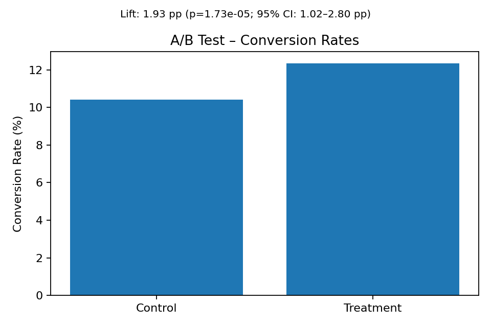

# A/B test framework for products

**A clean, production-minded A/B testing framework** for product decisions.  
It simulates experiments, runs statistical analysis (two-proportion z-test + bootstrap CIs), and produces clear, decision-ready visuals.


[](https://codecov.io/gh/Mahboubeh-Mt/ab-test-framework-products)


## Why this project
- **Decisions, not just models:** hypothesis → analysis → recommendation  
- **Statistical rigor:** difference in proportions, p-values, 95% bootstrap CIs  
- **Engineering discipline:** clear structure, tests, linting, CI

## Experiment Context

The goal was to increase product purchases on the Gerdoo e-commerce platform.

- **Version A (Control)**: current product page, layout, or pricing

- **Version B (Treatment)**

Users are randomly split into two groups so both versions are tested under the same conditions.
The key metric is purchase conversion rate = (number of purchases ÷ number of visitors).

If Version B’s conversion rate is statistically higher than Version A’s,
the change is considered effective and can be rolled out.

## Highlights
-  **Full Experimentation Cycle:** hypothesis → data → statistical validation → visual insights  
-  **Scalable & Modular:** clear separation of data generation, analysis, and visualization  
-  **Clean Engineering:** fully tested, linted (Ruff), and CI-validated via GitHub Actions  
-  **Statistical Foundations:** two-proportion z-test + bootstrap confidence intervals  
-  **Lightweight & Reproducible:** no external frameworks, runs anywhere with Python 3.12+

## Quickstart
```bash
# 0) install
pip install -r requirements.txt

# 1) generate synthetic data (control vs. treatment)
python -m src.cli generate --n 20000 --baseline 0.10 --effect 0.025 --seed 7

# 2) analyze (lift, p-value, CIs)
python -m src.cli analyze data/synthetic_ab.csv

# 3) plot (saves to outputs/figures/)
python -m src.cli plot data/synthetic_ab.csv
```
## Tech Stack
| Category | Tools |
|-----------|--------|
| Language | Python 3.12 |
| Core Libs | pandas • numpy • statsmodels • matplotlib |
| Testing & Linting | pytest • Ruff |
| CI/CD | GitHub Actions |

### Example output
| Metric | Control | Treatment | Result |
|:--------|:--------:|:-----------:|:--------|
| Conversion Rate | 10.4 % | 12.3 % | **+1.9 pp (+18 %)** |
| p-value | – | – | **1.7 × 10⁻⁵** |
| 95 % CI | – | – | **[+1.0 pp, +2.8 pp]** |


### Visual



### 👤 Author & Contact

**Mahboubeh Motaghi**

[](https://www.linkedin.com/in/mahboubeh-motaghi-phd-58033759)
[](https://scholar.google.com/citations?user=CkXNH2MAAAAJ&hl=en)
[](mailto:mahboubeh.motaghi@gmail.com)

[](LICENSE)